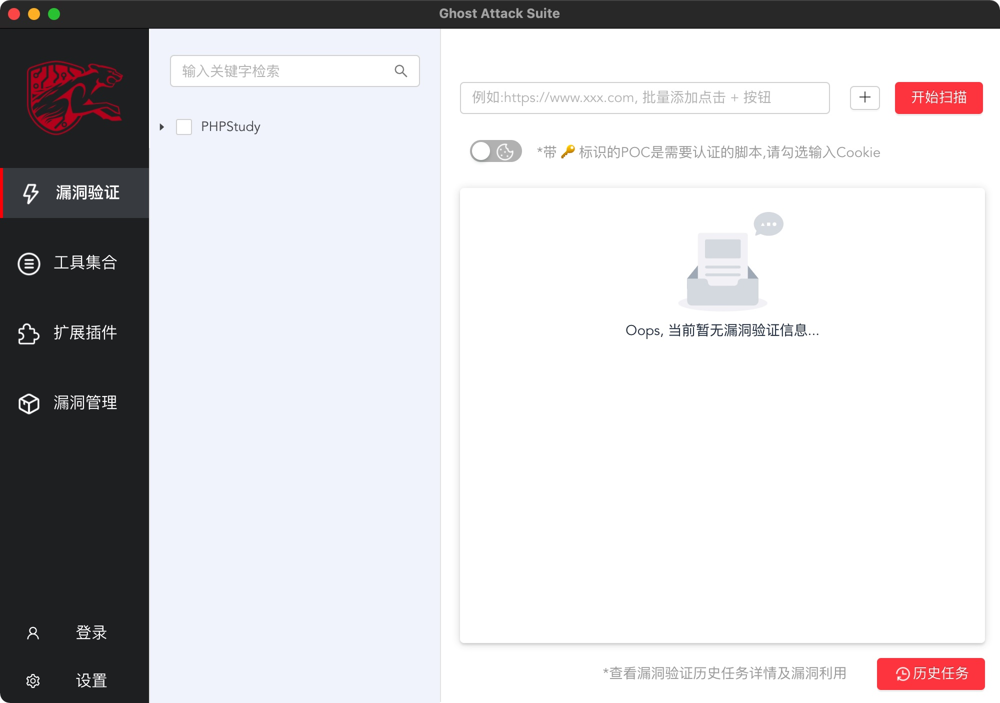

# GAS

## 使用说明-目录

- [GAS功能介绍](./docs/USE.md)  
- [利用脚本编写指南](./docs/POC.md)
- [插件编写指南](./docs/CJBX.md)

## 工具介绍

GAS，全称 Ghost Attack Suite，由猎豹安全实验室专为安全从业人员研发的跨平台渗透测试工具，工具内置漏洞检测框架支持对漏洞的验证以及利用，框架可灵活加载、编写新增攻击脚本，同时联动VulDB平台为攻击脚本库提供脚本支撑。框架还支持批量、代理、认证检测等功能；工具支持插件扩展功能，可扩展自定义插件加强工具能力，以及提供工具集模块，可灵活联动其他工具。工具可视化且操作方式便捷，内置环境变量可兼容各类使用场景，旨在打造一款高效的渗透测试工具。

## 环境

- Python 3
- Linux, Windows, Mac OSX

## 工具截图

# 说在最后

觉得不错的话, 别忘了 **star**  👏, 一个小小的 ***star*** 是我们前进的动力

如果您发现需要改进的地方，我们会考虑合理性并尽快修改。

如果您发现 ***bug*** 请及时提 ***issue***，我们会尽快确认并修改。

